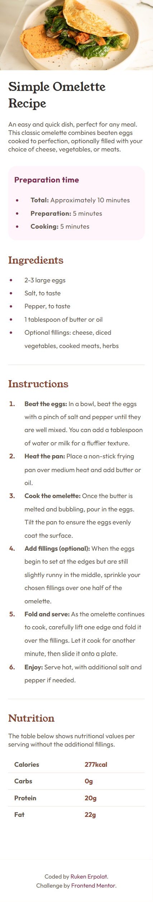
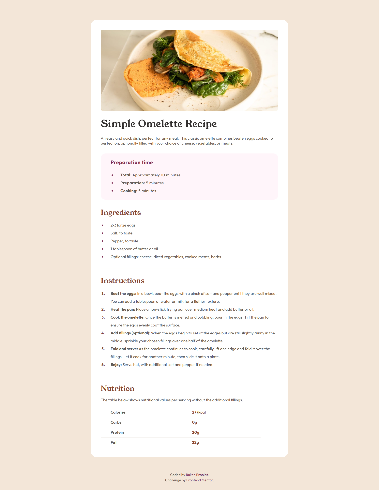

<h1 align="center">Frontend Mentor | Recipe Page</h1>

<div align="center">

🌐 [View Live Page](https://recipe-page-frontend-mentorr.netlify.app/)  

</div>

This is a solution to the [Recipe page challenge on Frontend Mentor](https://www.frontendmentor.io/challenges/recipe-page-KiTsR8QQKm). Frontend Mentor challenges help you improve your coding skills by building realistic projects.

### Built with

✦ Semantic HTML5    
✦ CSS3  
✦ Flexbox    
✦ Responsive Web Design (Media Queries)   
✦  Google Fonts: [Outfit](https://fonts.google.com/specimen/Outfit) & [Young Serif](https://fonts.google.com/specimen/Young+Serif)        

| Mobile                                    | Desktop                                   |
| ----------------------------------------- | ----------------------------------------- |
|  |  |
|                                                                                       |
 

### Project Structure

```
📁recipe-page
│
├── index.html
│
├── css/
│   └── style.css
│
├── assets/images/...
│
├── .gitignore
│
└── README.md
```

---

<br>

<b><em>Ruken ERPOLAT</em></b>

[](https://linkedin.com/in/rukenerpolat)
[](https://medium.com/@rukenerpolat)
[](https://github.com/rukenerpolat)